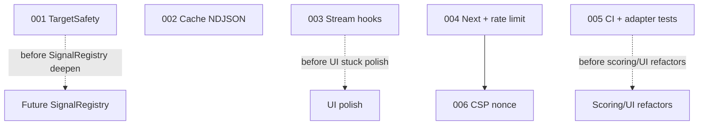

# Implementation Plans

Generated by the combined `/improve` advisory on 2026-07-17 against HEAD `76c4698`. Execute in the order below unless dependencies say otherwise. Each executor: read the plan fully before starting, honor its STOP conditions, and update your row when done.

**Written against:** `76c4698` (`76c4698cb72f090fea04a6da2a3ca566efd988e4`)

**Hard rule for this advisory wave:** plan files only under `plans/` until an operator selects `execute <plan>`. Do not edit application source while writing or reviewing these plans unless executing.

## Security reports

| Artifact | Path | Notes |
|----------|------|-------|
| Security best practices (full) | [`security-best-practices-report.md`](./security-best-practices-report.md) | SBP-01..08 with file:line evidence, positive controls, rejected/by-design |
| Branch security review | n/a (empty) | `/review-security` with `Diff: branch changes` on `main` @ `76c4698` had **no diff** — working tree clean and `main` == `origin/main`. Re-run after opening a feature branch or with `Diff: uncommitted changes`. |

## Recommended execution order

1. **001** — Unify TargetSafety (literal + post-DNS policy; DNS redaction)
2. **002** — Fix cache-hit NDJSON contract (`cached` flag + `signal_result` replay)
3. **003** — Stream hook error recovery (single + batch)
4. **004** — Next bump + rate-limit identity (+ Redis singleton)
5. **005** — CI pyramid + DNS/GSB adapter tests + format gate
6. **006** — CSP nonce + narrow `connect-src` (after Next bump)

## Execution order & status

| Plan | Title | Priority | Effort | Depends on | Status |
|------|-------|----------|--------|------------|--------|
| 001 | Unify TargetSafety (URL + probe + DNS) | P1 | M | - | DONE |
| 002 | Fix cache-hit NDJSON contract | P1 | S | - | DONE |
| 003 | Stream hook error recovery | P1 | S | - | DONE |
| 004 | Next bump + rate-limit identity | P1 | S | - | DONE |
| 005 | CI pyramid + adapter tests | P2 | M | - | TODO |
| 006 | CSP nonce + connect-src | P2 | M | 004 | DONE |

Status values: TODO | IN PROGRESS | DONE | BLOCKED (with one-line reason) | REJECTED (with one-line rationale)

## Dependency notes

- **001 before SignalRegistry deepen** — TargetSafety is the security seam; do not layer a registry on top of split private-network policies.
- **003 before UI stuck-state polish** — hooks must clear `isStreaming` on parse/network failure first.
- **004 before trusting proxy rate limits** — Next proxy-bypass advisories + spoofable `X-Forwarded-For` undermine the limiter until patched.
- **005 before large scoring/UI refactors** — close the documented quality bar so regressions cannot merge silently.
- **006 after 004** — CSP nonce work should land on a patched Next version (CSP-nonce XSS advisories exist in the 16.0.0–16.2.5 range).

Plans **001–005** and **006** are independent of each other except 006→004. They may run on parallel branches if merge conflicts are managed.

## Findings considered and rejected (do not re-open without new evidence)

- **GSB `?key=` query param** — Google Lookup API v4 contract; rotate + scrub logs, do not “fix” to header without docs support.
- **Idle-defer history rail** — settled in `AGENTS.md` (Lighthouse regression). Spike only with Lighthouse+smoke gate.
- **Reintroduce PhishTank / SSE / `middleware.ts`** — settled anti-patterns.
- **Missing HSTS** — intentionally not recommended without full understanding of HTTPS-only deploy topology.
- **`/review-security` empty diff** — not a finding; no branch delta on `main` @ `76c4698`.
- **SBP-08 tooling vite/ws** — not in production Next runtime path; out of default product plans.
- **Finding 7 (raw `error.message` in streams)** — SBP-06; deferred from default set (ask to add).
- **Finding 10 (VT LED threshold vs verdict)** — deferred (ask to add).
- **Finding 12 (duplicate DNS lookups)** — deferred perf work.

## Out of default set (ask if wanted)

- SBP-06 / finding 7 — sanitize streamed exception messages
- Finding 10 — align VT card LED with verdict thresholds
- SignalRegistry / ScanSession architecture deepen
- History pagination
- Shared DNS resolve cache across dns/ssl/redirect
- Tooling-only vite/ws bumps (SBP-08)
